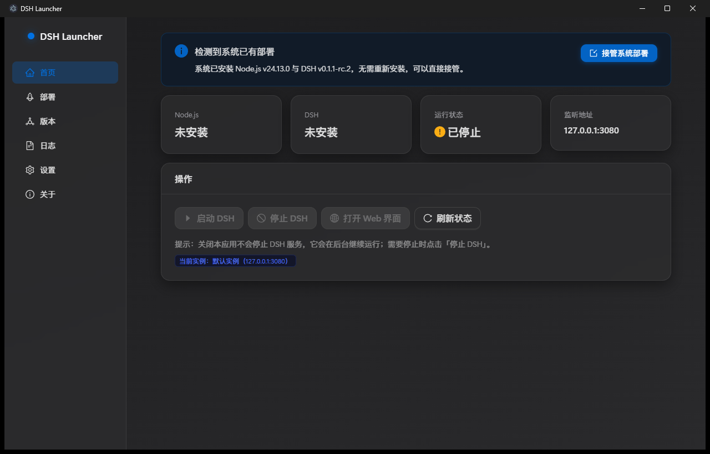

# DSH Launcher

> 一键部署与管理 [DeepSeek Harness](https://github.com/deepseek-ai/deepseek-harness)（DSH）的 Windows 桌面工具
> **开箱即用 · 免管理员权限 · 卸载零残留**

   [](https://github.com/zhanweipan/dsh-launcher/releases/latest)

DeepSeek Harness（DSH）是一个强大的 AI Agent 开发环境，但自己安装 Node.js、配置环境、敲命令行，对普通用户来说门槛不低。

**DSH Launcher 把这些全部打包进一个桌面程序**：装好它，跟着向导点几下，Node.js 和 DSH 就都装好了，一键启动就能在浏览器里用上完整的 AI Agent 工作台。

---

## 📸 界面预览



> 更多截图（部署向导 / 版本管理 / 日志 / 设置）陆续补充中；也欢迎在 [Issues](https://github.com/zhanweipan/dsh-launcher/issues) 提建议。

---

## ✨ 为什么用 DSH Launcher

| 没有它 | 有了它 |
|---|---|
| 先装 Node.js，配 PATH，可能还要管理员权限 | ✅ 自动下载安装，**全程免管理员** |
| 命令行敲 `npm i -g @deepseek-ai/dsh`，处理各种报错 | ✅ 一键部署，进度可视化 |
| 记住 `dsh web --host --port` 各种参数 | ✅ 图形化启停 / 端口 / 日志 |
| 想升级还得查文档手动操作 | ✅ 版本一键升级降级 |
| 卸载后一堆残留 | ✅ 数据全在用户目录，卸载即删 |

面向**小白用户**设计，也保留了技术用户需要的全部能力。

## 🚀 快速开始

1. **下载**：[GitHub Releases](https://github.com/zhanweipan/dsh-launcher/releases/latest) 下载 `DSH Launcher-Setup-0.2.2.exe`（约 80MB）
2. **安装**：双击安装，向导式，无需管理员权限
3. **首次打开**：跟着「一键部署」向导走，自动完成 Node.js + DSH 安装（需联网，约几分钟）
4. **启动**：首页点「启动 DSH」→ 自动打开浏览器 → 开始使用 DeepSeek Harness！

> 💡 **如果你已经装过 DSH**：打开程序后首页会提示「检测到系统已有部署」，点「接管系统部署」即可直接管理，无需重新安装。

## 🧭 功能特性

- **一键部署**：自动下载官方 Node.js（SHA256 校验）+ npm 安装 DSH，全程可视化进度，无需管理员权限、不污染系统
- **接管系统已有部署**：检测到系统已装 Node.js + DSH 时一键接管，无需重装
- **一键启停**：启动 / 停止 DSH Web 服务（默认 `127.0.0.1:3080`），健康检查确认就绪
- **端口 / 主机设置**：修改端口即时生效，启动前自动检测端口占用并友好提示
- **实时日志**：查看 / 过滤 / 导出 DSH 运行日志
- **版本管理**：Node.js 与 DSH 版本列表，一键升级、降级、切换（自动先停实例）
- **多实例管理**：配置多个实例（名称 / 端口），随时切换
- **npm 镜像切换**：内置官方源 / 淘宝镜像，国内用户也能快速安装
- **开机自启** + **启动后自动打开浏览器**
- **终端直接用 `dsh`**：可选把自管 dsh 命令加入用户 PATH
- **应用自动更新**：GitHub Releases 发布新版本后，设置页一键升级
- **安装包交付**：NSIS 向导，桌面 / 开始菜单快捷方式，卸载干净

## 🛠 使用指南

### 两种部署方式

| | 自管部署（默认） | 接管系统已有部署 |
|---|---|---|
| 适用 | 全新安装，最省心 | 你已经装好 Node + DSH |
| Node/DSH 位置 | 程序数据目录内 | 使用系统已有的 |
| 卸载影响 | 数据随程序删除 | 不影响系统安装 |
| 版本管理 | ✅ 可用 | ❌ 由系统自己管理 |

切换位置：设置 → 部署方式。

### 数据目录

所有运行时数据都在用户目录下，卸载程序后不留残留：

```
%APPDATA%\dsh-launcher\
  ├─ runtime\node-vX\    # Node.js 各版本
  ├─ prefix\node_modules\ # DSH / pnpm 安装区
  ├─ logs\               # 运行日志
  └─ settings.json       # 配置
```

DSH 自身的配置（模型、API Key 等）在 DSH_HOME（默认 `%USERPROFILE%\.dsh`），设置页有快捷打开入口。

## ❓ 常见问题

**Q：启动时提示端口被占用？**
说明已有 DSH 实例在运行（可能是另一个 Launcher 启动的）。先停止它，或在设置里更换端口。

**Q：系统里装了旧版 DSH Launcher，两个程序"混在一起"？**
两个同名程序会共用数据目录导致混乱。请卸载旧版并清理 `%APPDATA%\dsh-launcher` 后再安装新版。

**Q：检查更新时提示网络错误 / 502？**
部分网络环境用 GitHub 加速工具转发 CDN 不稳定，属间歇性问题（0.2.2 起已内置自动重试），可稍后再试。

**Q：安装时 Windows 提示"未知发布者"？**
目前未做代码签名，点「更多信息 → 仍要运行」即可；正式分发前将接入云签名。

**Q：关闭程序会不会停掉 DSH？**
不会。关闭程序不影响已启动的 DSH 服务（需停止请在首页点「停止 DSH」）。

**Q：升级 / 降级 Node 或 DSH 会丢数据吗？**
不会。版本切换只更换运行环境，DSH 的会话与配置（DSH_HOME）保持不变。

## 🏗 技术架构

```
Electron GUI（React 18 + Ant Design 5）
        │ IPC（contextBridge）
主进程（核心管理逻辑，纯 Node、可单测）
  ├─ NodeInstaller  下载/校验/解压 Node.js（官方 win-x64 zip + SHA256）
  ├─ DshInstaller   npm install -g @deepseek-ai/dsh --prefix <自管目录>
  ├─ RuntimeManager spawn dsh web + 健康探测 + 停止/进程树清理
  ├─ SystemDetector 检测系统已有 Node/DSH（接管模式）
  ├─ VersionManager 版本列表与切换
  └─ LogHub         内存环形缓冲 + 按天滚动写日志
```

关键设计决策：

- **Node.js 不自带、不装系统**：官方 zip 解压到数据目录，免管理员权限、天然支持多版本、可卸载
- **DSH 装进自管 prefix**：不写系统 npm 全局目录，卸载即删
- **启动不依赖 PATH**：直接 spawn 自管 node 运行 `dsh web`
- **监听仅本机**：遵循 DSH 安全限制（不支持 0.0.0.0）

## 💻 开发

要求 Node.js >= 18。

```bash
npm install        # 安装依赖
npm run dev        # 开发模式（热更新）
npm run typecheck  # 类型检查
npm run build      # 构建产物到 out/
npm run dist       # 构建 + 打包 NSIS 安装包（dist/）
```

- 问题反馈 / 功能建议：欢迎提 [Issues](https://github.com/zhanweipan/dsh-launcher/issues)
- 想参与开发：Fork 后提交 PR，感谢每一位贡献者

## 📦 发布

发布新版本（GitHub Releases + 自动更新）详见 [RELEASE.md](./RELEASE.md)。变更记录见 [CHANGELOG.md](./CHANGELOG.md)。

## 🗺 路线图

- [x] M1：一键部署链路 + 启停 / 端口 / 日志 + 接管系统已有部署
- [x] M2：版本管理、开机自启、应用自动更新
- [x] M3：多实例管理、PATH 暴露 dsh 命令、模型配置引导
- [x] 发布流程打通：GitHub Releases + 自动更新实测通过（0.2.2）
- [ ] 自定义图标、代码签名
- [ ] 并发多实例同时运行、模型 / API Key 图形化配置

## 🙏 致谢

- [DeepSeek Harness](https://github.com/deepseek-ai/deepseek-harness) —— 本项目管理与部署的对象
- Electron、electron-vite、electron-builder、React、Ant Design 等开源项目

## 📄 License

[MIT](./LICENSE) © 2026 zhanwei